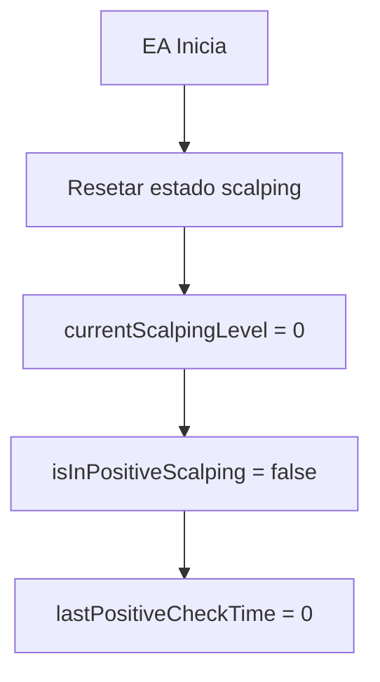
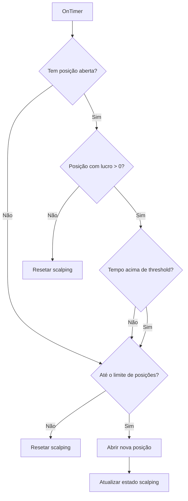
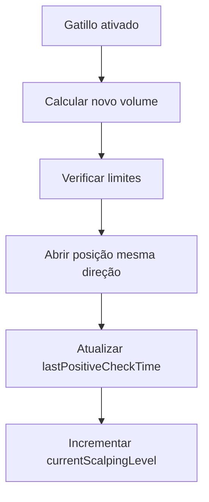
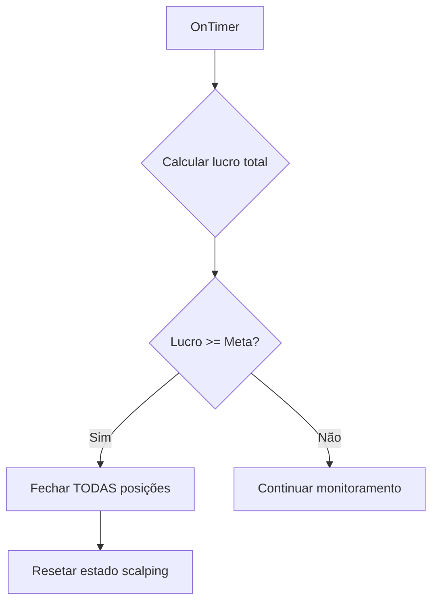

# Especificação Técnica: Compras Múltiplas por Positividade (Scalping Positivo)

## 1. Conceito

O sistema "Positive Scalping" abre novas posições na mesma direção da posição atual sempre que ela mantiver lucro por mais de 15 segundos. O objetivo é capitalizar tendências fortes e atingir uma meta de lucro total em pontos.

## 2. Funcionamento

### 2.1. Gatilho de Abertura
- Posição atual deve estar com lucro (> 0 pontos)
- Posição deve manter lucro por 15 segundos consecutivos
- Abre nova posição na mesma direção (não inverte)
- Intervalo mínimo de 15 segundos entre novas posições

### 2.2. Gerenciamento de Volume
- Volume inicial: Volume original do trade
- Multiplicador opcional (ex: 1.5x volume anterior)
- Limite máximo de posições simultâneas
- Pausa ao atingir meta de lucro

### 2.3. Encerramento
- Fecha TODAS as posições quando meta total de lucro for atingida
- Meta configurável em pontos (ex: 200 pontos total)
- Não usa stop loss individual, depende do encerramento total

## 3. Parâmetros de Configuração

```mql5
//--- Positive Scalping Parameters
input bool     EnablePositiveScalping = false;        // Ativar sistema de scalping positivo
input int      PositiveProfitSeconds = 15;           // Segundos de lucro para abrir nova posição
input double   ScalpingVolumeMultiplier = 1.5;        // Multiplicador do volume
input int      MaxScalpingLevels = 5;                // Máximo de posições escalping
input int      ScalpingProfitTarget = 200;           // Meta de lucro total em pontos
input bool     EnableScalpingBreakeven = true;        // Ativar breakeven para posições escalping
input int      ScalpingBreakevenPoints = 50;         // Pontos de lucro para ativar breakeven
```

## 4. Estado do Sistema

### 4.1. Variáveis Globais
```mql5
//--- Positive Scalping State
int currentScalpingLevel = 0;         // Nível atual de scalping (0 = sem scalping)
bool isInPositiveScalping = false;    // Flag indicando modo scalping ativo
double lastScalpingVolume = 0;         // Volume da última posição de scalping
datetime lastPositiveCheckTime = 0;   // Última verificação de positividade
double totalScalpingProfit = 0;       // Lucro total acumulado nas posições de scalping
```

### 4.2. Cálculos de Lucro
- Lucro total de TODAS as posições (original + scalping)
- Verificação a cada segundo
- Acumula lucro mesmo com flutuações
- Considera swaps/comissões se disponíveis

## 5. Fluxo de Operação

### 5.1. Inicialização


### 5.2. Verificação Contínua (OnTimer)


### 5.3. Abertura de Nova Posição


### 5.4. Verificação de Meta


## 6. Gestão de Riscos

### 6.1. Controles
- Limite máximo de posições (MaxScalpingLevels)
- Pausa automática ao atingir meta
- Volume crescente controlado
- Reset se posição original fechar

### 6.2. Proteções
- Não abre se preço se afastar demais do ponto de entrada
- Pausa se drawdown exceder limite (opcional)
- Timeout máximo de operação (opcional)

## 7. Integração com Sistemas Existentes

### 7.1. Com Hedge
- Mutualmente exclusivo? Ou pode operar junto?
- Sugestão: Desabilitar hedge quando scalping positivo está ativo

### 7.2. Com Trend Continuation
- Não interfere no reentry após TP
- Scalping é temporário, trend continuation é após fechamento

### 7.3. Com Candle Confirmation
- Respeita as mesmas regras de confirmação
- Pode ser combinado ou separado

## 8. Interface e Feedback

### 8.1. Logs
```
=== POSITIVE SCALPING TRIGGERED ===
Position profitable for 15+ seconds
Opening new scalping position #1
Volume: 0.02 (1.5x previous)
Total positions: 2

=== POSITIVE SCALPING PROGRESS ===
Current profit: +85 points
Target: 200 points
Positions: 3

=== POSITIVE SCALPING TARGET REACHED ===
Total profit: 215 points (Target: 200)
Closing ALL positions
=== POSITIVE SCALPING SUCCESS ===
```

### 8.2. Painel
- Indicador de modo scalping ativo
- Nível atual: X/Y
- Lucro acumulado: XXX pontos
- Próxima posição em: X segundos

## 9. Cenários de Teste

### 9.1. Sucesso
- Posição abre com lucro
- Mantém lucro > 15s
- Abre segunda posição
- Continua até atingir meta
- Fecha todas posições

### 9.2. Parcial
- Abre 2-3 posições
- Mercado reverte antes da meta
- Posições fecham com lucro menor
- Reseta para próxima oportunidade

### 9.3. Falha
- Posição abre com prejuízo
- Sistema não aciona
- Ou atinge limite de posições
- Espera próxima oportunidade

## 10. Prioridade e Fase

- **Prioridade:** Alta (estratégia nova de lucro)
- **Fase:** Nova feature completa
- **Dependências:** Nenhuma (pode ser adicionada independentemente)
- **Compatibilidade:** Funciona com todos os outros sistemas